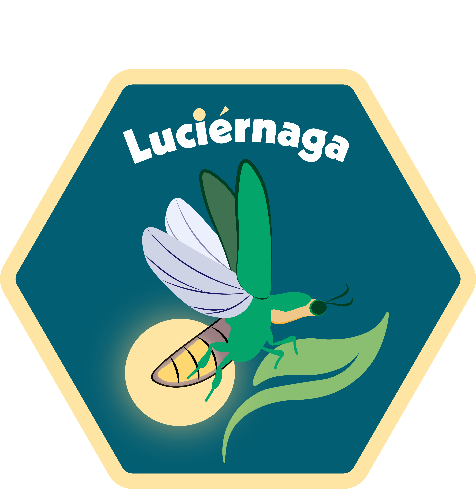

<!-- To modify Package/Title/Description/Authors fields, edit the DESCRIPTION file -->


<!-- badges: start -->
[](https://github.com/DavidRach/Luciernaga/actions)
[-blue.svg)](https://cran.r-project.org/web/licenses/AGPL (>= 3))
[](https://github.com/DavidRach/Luciernaga)
[](https://github.com/DavidRach/Luciernaga)
[](https://github.com/DavidRach/Luciernaga/commits/master)
[](https://codecov.io/gh/DavidRach/Luciernaga)
<br>
<!-- badges: end -->

```{r,echo=FALSE, out.width='50%', fig.width=3, fig.height=3, fig.align="center"}

```


```{r, echo=FALSE, include=FALSE}
pkg <- read.dcf("DESCRIPTION", fields = "Package")[1]
title <- read.dcf("DESCRIPTION", fields = "Title")[1]
description <- read.dcf("DESCRIPTION", fields = "Description")[1]
URL <- read.dcf('DESCRIPTION', fields = 'URL')[1]
owner <- tolower(strsplit(URL,"/")[[1]][4])
```
 
## ``r pkg``: `r title`

### `r description`
 
If you use ``r pkg``, please cite: 

<!-- Modify this by editing the file: inst/CITATION  -->
> `r utils::citation(pkg)$textVersion`

## Installation 

```R
if(!require("remotes")) install.packages("remotes")

remotes::install_github("`r URL`")
library(`r pkg`)
```
## Documentation 

### [Website](https://`r owner`.github.io/`r pkg`) 
### [Get started](https://`r owner`.github.io/`r pkg`/articles/`r pkg`) 

<br>
