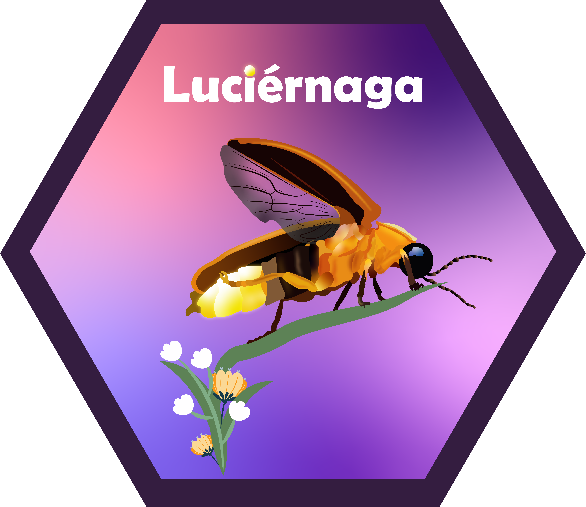

# Welcome to `Luciernaga` 

<!-- To modify Package/Title/Description/Authors fields, edit the DESCRIPTION file -->
<!-- badges: start -->

[](https://github.com/DavidRach/Luciernaga/actions)
[-blue.svg)](https://cran.r-project.org/web/licenses/AGPL%20(%3E=%203))
[](https://github.com/DavidRach/Luciernaga)
[](https://github.com/DavidRach/Luciernaga)
[](https://github.com/DavidRach/Luciernaga/commits/master)
[](https://codecov.io/gh/DavidRach/Luciernaga)
<br> <!-- badges: end -->

## `Luciernaga`: Quality checks, signature interrogation, and data visualization for Spectral Flow Cytometry (SFC) unmixing controls.

Spectral flow cytometry (SFC) ability to resolve very similar fluorophores and rapidly acquire large numbers of cellular events combines beneficial aspects of both conventional flow cytometry (CFC) and mass cytometry (MC). 

Proper unmixing controls (both single-color and unstained) are essential to ensure proper unmixing of full-stained samples. Despite their critical role, few tools exist to examine the quality of individual unmixing controls. 

Luciernaga is an R package containing tools to allow individual researchers to implement quality control checks, signature interrogation and data visualization during the pre-unmixing stages to make informed decisions, both at the level of individual .fcs files as well as across time. 

### Installation

We are in the process of getting Luciernaga ready to submit to Bioconductor. Until then, please download the package from github. 

``` r
if(!require("remotes")) install.packages("remotes")

remotes::install_github("https://github.com/DavidRach/Luciernaga")

library(Luciernaga)

# install.packages("BiocManager")
# BiocManager::install("Luciernaga")
```

### Get Started

Please check out our how-to [vignettes](https://davidrach.github.io/Luciernaga/articles/Luciernaga)
to get started


### Found a bug? Report it!

While we have caught a lot of bugs, there's still unknown ones that we haven't encountered. If you find a suspected bug, please report it here [here](https://github.com/DavidRach/Luciernaga/issues)
